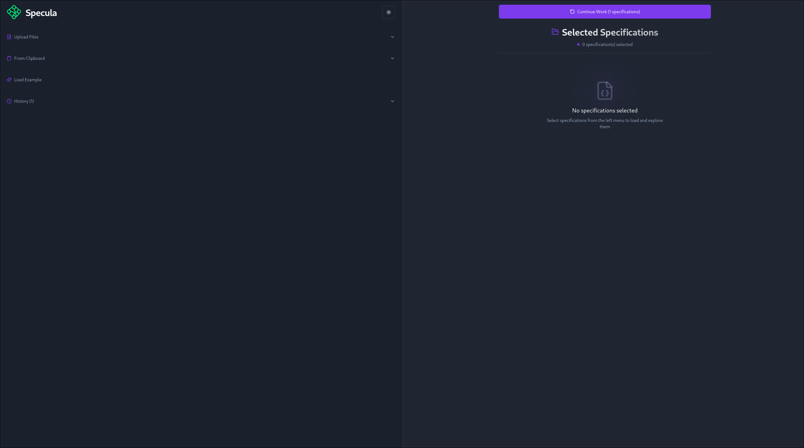
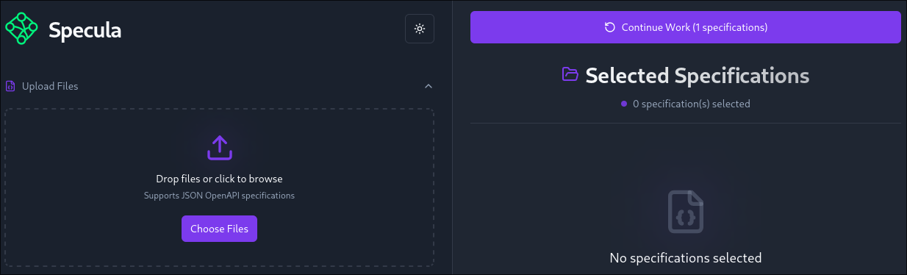
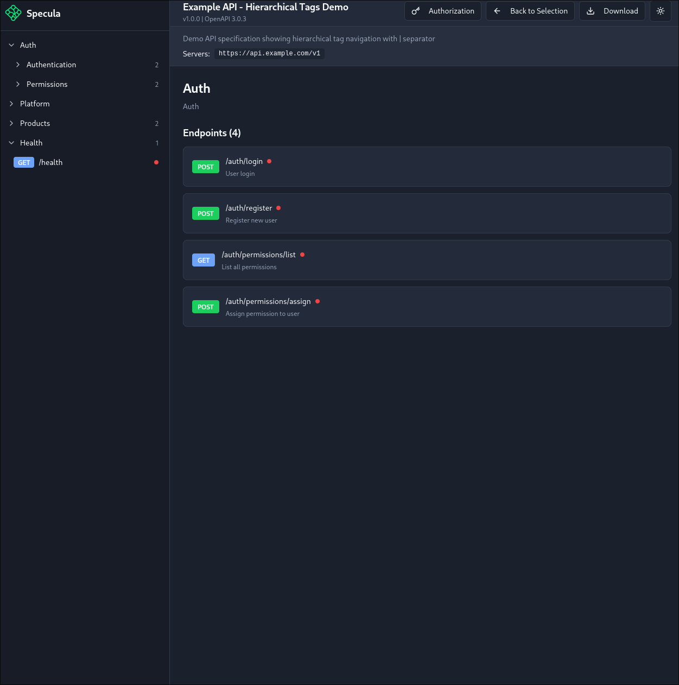
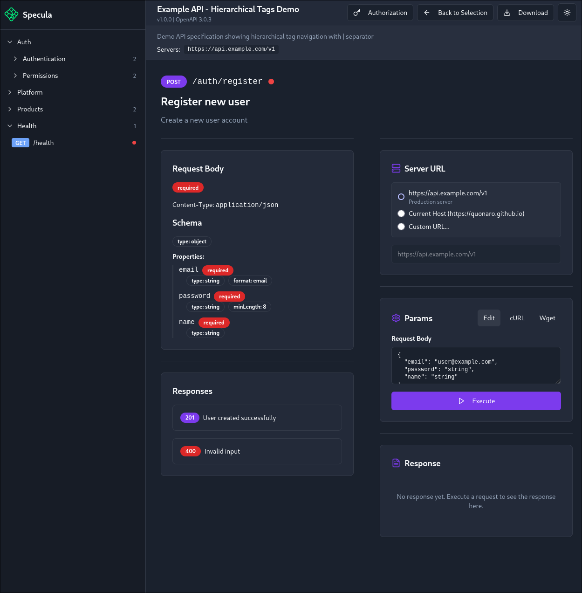
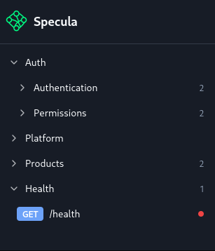

# Specula

Specula is a modern web interface for viewing and testing OpenAPI specifications. The application provides a convenient way to navigate API documentation, view endpoints, and test requests.

## Preview

[📹 Watch Preview Video](docs/videos/preview.mp4)

## Features

- 📄 **Specification Loading** - support for loading OpenAPI specifications from files, URLs, or clipboard
- 🔄 **Multiple Specifications** - work with multiple OpenAPI specifications simultaneously, each organized as a separate top-level group
- 🌳 **Hierarchical Tag Grouping** - support for hierarchical tag navigation using the `|` separator in OpenAPI 3+ (e.g., `"Auth | Authentication"` creates nested groups)
- 🔍 **API Navigation** - hierarchical structure of tags and endpoints
- 🧪 **Try It Out** - interactive testing of API endpoints directly from the browser
- 💾 **Caching** - automatic saving of loaded specifications
- ⭐ **Favorites** - ability to save frequently used specifications
- 📱 **Responsive Design** - works on all devices

## Live Demo

Try the example version: **[https://quonaro.github.io/Specula/](https://quonaro.github.io/Specula/)**

## Screenshots

### Main Page


Screenshot of the main application page with empty state or loaded specification. Shows the interface for selecting and loading specifications.

### Upload Specification


Screenshot of the OpenAPI specification upload process. Shows various loading methods: file upload, paste from clipboard, load from URL.

### Endpoints View


Screenshot of the API endpoints list interface. Shows the structure of endpoints, request methods (GET, POST, PUT, DELETE, etc.) and their descriptions.

### Endpoint Details


Screenshot of the endpoint detail page. Shows complete information about the endpoint: request parameters, response schema, usage examples.

### Endpoint Grouping


Screenshot showing endpoint grouping functionality. Displays how endpoints are organized into hierarchical groups based on tags, allowing easy navigation through large API specifications with nested tag structures.

## Installation and Setup

### Requirements

- Node.js 20 or higher
- npm or another package manager

### Install Dependencies

```bash
npm install
```

### Run in Development Mode

```bash
npm run dev
```

The application will be available at `http://localhost:8080`

### Build for Production

```bash
npm run build
```

Built files will be in the `dist/` folder

### Preview Production Build

```bash
npm run preview
```

## Environment Variables

The following environment variables are used when building for production:

- `VITE_BASE_PATH` - base path of the application (default `/Specula/` for GitHub Pages)
- `VITE_WITHOUT_BACKEND` - disable backend checking (default `true` in production)
- `VITE_EXAMPLE` - show example load button (default `true` in production)

## Technologies

- **Vue 3** - progressive JavaScript framework
- **Vite** - fast build tool
- **Vue Router** - routing for SPA
- **Pinia** - state management
- **TypeScript** - typed JavaScript
- **Tailwind CSS** - utility-first CSS framework

## Roadmap

### Backend Proxy Support (Coming Soon)

Backend support for proxying all API requests is planned to be added soon. This will allow testing API endpoints directly from the browser without CORS (Cross-Origin Resource Sharing) restrictions. The backend will act as a proxy server, forwarding requests to the target APIs and returning responses, eliminating the need for CORS preflight requests and enabling seamless API testing.

## License

MIT License - see [LICENSE](LICENSE) file for details.
